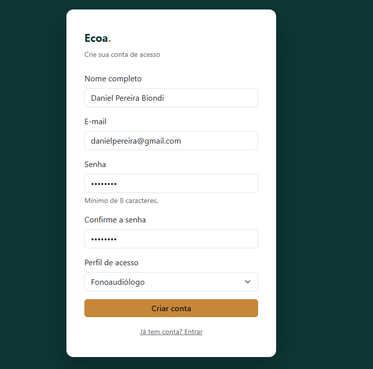
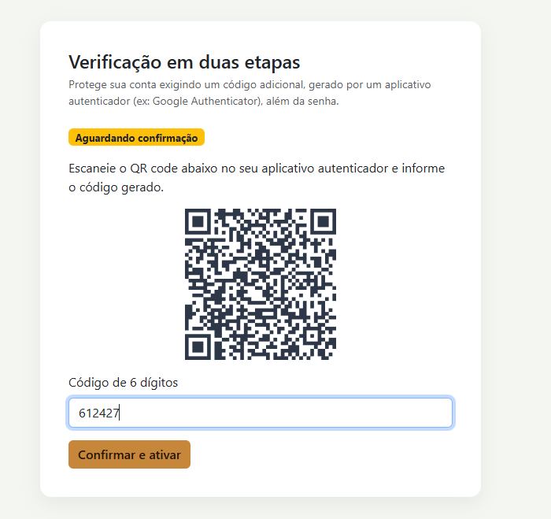

# Requisito 1 — Autenticação e Gestão de Credenciais

Este documento apresenta a implementação do módulo de **Autenticação e Gestão de Credenciais** do projeto **Ecoa**, desenvolvido com Laravel.

A documentação aborda os requisitos de segurança relacionados ao armazenamento de senhas, autenticação em dois fatores, gerenciamento de sessões, logout, proteção contra tentativas excessivas de login e as respectivas evidências de funcionamento.

O objetivo desta documentação é apresentar não apenas as funcionalidades implementadas, mas também explicar as decisões técnicas utilizadas no desenvolvimento.

---

# Sumário

1. [Visão geral e tecnologias utilizadas](#1-visão-geral-e-tecnologias-utilizadas)
2. [Fluxo de autenticação](#2-fluxo-de-autenticação)
3. [Hash e armazenamento de senhas](#3-hash-e-armazenamento-de-senhas)
4. [Autenticação de dois fatores](#4-autenticação-de-dois-fatores)
5. [Gerenciamento de sessões e logout](#5-gerenciamento-de-sessões-e-logout)
6. [Proteção contra força bruta](#6-proteção-contra-força-bruta)
7. [Justificativas técnicas](#7-justificativas-técnicas)
8. [Evidências de funcionamento](#8-evidências-de-funcionamento)
9. [Checklist dos requisitos](#9-checklist-dos-requisitos)
10. [Considerações finais](#10-considerações-finais)

---

# 1. Visão geral e tecnologias utilizadas

O módulo de autenticação do Ecoa utiliza o **Laravel Fortify** como base para os recursos de autenticação.

O Fortify foi utilizado porque fornece uma implementação consolidada para funcionalidades como login, cadastro, logout, recuperação de senha, autenticação em dois fatores e controle de tentativas de autenticação.

A interface do sistema foi desenvolvida separadamente, utilizando as views Blade do projeto. Dessa forma, o Fortify é responsável principalmente pela lógica de autenticação, enquanto as telas e a experiência de utilização foram desenvolvidas de acordo com a identidade visual do Ecoa.

## Tecnologias utilizadas

- Laravel 12
- PHP
- Laravel Fortify
- Blade
- Bootstrap
- Banco de dados relacional
- Argon2id para armazenamento das senhas
- TOTP para autenticação em dois fatores

## Principais arquivos relacionados à autenticação

```text
app/Providers/FortifyServiceProvider.php

→ Configuração dos serviços de autenticação e Rate Limiters.

app/Actions/Fortify/CreateNewUser.php

→ Responsável pela criação de novos usuários.

app/Models/User.php

→ Model de usuário e configuração relacionada ao 2FA.

app/Http/Controllers/SecurityController.php

→ Exibição da área de segurança da conta.

resources/views/auth/

→ Views de login, cadastro, recuperação de senha e desafio 2FA.

resources/views/security.blade.php

→ Interface de gerenciamento da autenticação em dois fatores.

config/fortify.php

→ Configuração dos recursos disponibilizados pelo Fortify.

config/hashing.php

→ Configuração do algoritmo utilizado para o hash das senhas.

config/session.php

→ Configuração do tempo de duração das sessões.
```

---

# 2. Fluxo de autenticação

O sistema possui diferentes etapas de autenticação, dependendo da configuração de segurança da conta.

## 2.1 Cadastro

O cadastro ocorre da seguinte forma:

```text
Usuário
   |
   | Acessa /register
   v
Tela de cadastro
   |
   | Envia nome, e-mail e senha
   v
Laravel Fortify
   |
   | Validação dos dados
   | Hash da senha
   v
Banco de dados
   |
   | Usuário criado
   v
Autenticação
   |
   v
Área autenticada
```

Durante o cadastro, a senha informada pelo usuário não é armazenada diretamente no banco de dados.

Antes do armazenamento, ela passa pelo mecanismo de hashing configurado na aplicação, utilizando o algoritmo Argon2id.

---

## 2.2 Login sem 2FA

Quando o usuário ainda não possui autenticação em dois fatores configurada, o fluxo ocorre da seguinte maneira:

```text
Usuário
   |
   | E-mail + senha
   v
Tela de login
   |
   v
Laravel Fortify
   |
   | Verificação do Rate Limit
   |
   | Busca do usuário
   |
   | Verificação da senha
   v
Sessão autenticada
   |
   v
/home
```

Caso as credenciais estejam corretas e o usuário não esteja sujeito a uma etapa adicional de autenticação, o acesso à área autenticada é liberado.

---

## 2.3 Login com 2FA

Quando o usuário possui 2FA ativado e confirmado, o login possui uma etapa adicional:

```text
Usuário
   |
   | E-mail + senha
   v
Laravel Fortify
   |
   | Credenciais válidas
   v
Verificação do 2FA
   |
   | Código TOTP
   v
Validação do código
   |
   | Código válido
   v
Sessão autenticada
   |
   v
/home
```

Assim, possuir apenas a senha não é suficiente para concluir a autenticação em uma conta protegida pelo segundo fator.

---

## 2.4 Ativação do 2FA

A ativação da autenticação em dois fatores ocorre pela área de segurança da aplicação.

O processo é:

1. O usuário acessa a área de segurança.
2. O sistema solicita uma nova confirmação da senha.
3. O usuário confirma sua identidade.
4. O sistema gera o segredo utilizado pelo TOTP.
5. Um QR Code é disponibilizado para configuração no aplicativo autenticador.
6. O usuário informa o código gerado pelo aplicativo.
7. O sistema valida o código.
8. Após a confirmação, o 2FA passa a fazer parte do processo de login.

O sistema também disponibiliza códigos de recuperação para situações em que o usuário não tenha acesso ao aplicativo autenticador.

---

## 2.5 Logout

O logout encerra a sessão autenticada do usuário.

O processo é realizado pelo Laravel Fortify por meio da rota de logout disponibilizada pela autenticação.

O fluxo esperado é:

```text
Usuário
   |
   | Solicita logout
   v
Laravel Fortify
   |
   | Encerra autenticação
   | Invalida sessão
   | Regenera token CSRF
   v
Usuário não autenticado
   |
   v
Página pública
```

A rota utilizada pelo projeto é:

```text
POST /logout
```

Essa rota é fornecida pelo `AuthenticatedSessionController` do Laravel Fortify.

---

# 3. Hash e armazenamento de senhas

## 3.1 Algoritmo utilizado

O Ecoa utiliza **Argon2id** para o armazenamento seguro das senhas.

A configuração é definida em:

```text
config/hashing.php
```

A aplicação utiliza o driver `argon2id` para realizar o hashing das senhas:

```php
'driver' => env('HASH_DRIVER', 'argon2id'),
```

O objetivo do hashing é impedir que a senha original precise ser armazenada no banco de dados.

Dessa forma, a senha do usuário não fica disponível em texto puro no banco de dados.

---

## 3.2 Parâmetros de custo

O Argon2id possui parâmetros que determinam o custo computacional utilizado durante a geração e verificação do hash.

No ambiente de desenvolvimento, os parâmetros configurados foram verificados através do Laravel Tinker:

```text
memory  = 65536
threads = 1
time    = 4
verify  = true
```

Esses valores representam:

| Parâmetro | Valor | Função |
|---|---:|---|
| `memory` | 65536 KB | Quantidade de memória utilizada |
| `threads` | 1 | Paralelismo utilizado |
| `time` | 4 | Custo de tempo/iterações |
| `verify` | true | Verificação dos parâmetros do hash durante a operação |

A representação do hash observada no ambiente também apresenta:

```text
m=65536,t=4,p=1
```

Os parâmetros aumentam o custo necessário para realizar grandes quantidades de tentativas de descoberta de senhas.

Os valores devem ser avaliados de acordo com o ambiente de execução do projeto, pois o desempenho pode variar conforme o hardware disponível.

---

## 3.3 Salt criptográfico

O Argon2id utiliza um **salt aleatório** durante a geração do hash.

Esse salt é gerado automaticamente pelo mecanismo de hashing e não precisa ser criado manualmente pela aplicação.

Consequentemente, duas contas que utilizem a mesma senha podem possuir hashes diferentes.

Isso dificulta ataques baseados na comparação direta de hashes e no uso de tabelas pré-computadas.

---

## 3.4 Armazenamento do hash e salt

O salt não precisa ser armazenado em uma coluna separada.

O padrão utilizado pelo Argon2id armazena as informações necessárias dentro da própria representação do hash.

Um hash Argon2id possui uma estrutura semelhante a:

```text
$argon2id$v=19$m=65536,t=4,p=1$SALT$HASH
```

Nesse formato estão presentes:

| Parte | Função |
|---|---|
| `argon2id` | Algoritmo utilizado |
| `v=19` | Versão do algoritmo |
| `m=65536` | Memória utilizada |
| `t=4` | Custo de tempo |
| `p=1` | Paralelismo |
| `SALT` | Salt utilizado |
| `HASH` | Resultado do processo de hashing |

Essas informações fazem parte da representação armazenada no campo de senha do usuário.

A aplicação não precisa armazenar a senha original para realizar a autenticação.

---

# 4. Autenticação de dois fatores

## 4.1 Implementação

O Ecoa utiliza **TOTP (Time-based One-Time Password)** para implementar a autenticação em dois fatores.

O TOTP gera códigos temporários que podem ser utilizados por aplicativos autenticadores.

O processo de ativação é:

```text
Usuário
   |
   | Solicita ativação
   v
Sistema gera segredo
   |
   v
QR Code
   |
   v
Aplicativo autenticador
   |
   | Gera código temporário
   v
Usuário informa código
   |
   v
Sistema valida código
   |
   v
2FA confirmado
```

O segredo utilizado pelo 2FA é armazenado de forma protegida pelo mecanismo utilizado pelo Fortify.

Além disso, o sistema possui códigos de recuperação para permitir o acesso à conta em situações específicas.

---

## 4.2 Validação após a autenticação primária

A autenticação em dois fatores adiciona uma segunda etapa ao processo de login.

Primeiramente, o sistema verifica:

```text
E-mail
+
Senha
```

Após a validação dessas informações, caso o usuário possua 2FA confirmado, o sistema solicita:

```text
Código TOTP
```

Somente após a validação do segundo fator o processo de autenticação é concluído.

Isso reduz o impacto de uma eventual exposição da senha, pois a senha isoladamente não é suficiente para concluir o acesso à conta protegida pelo 2FA.

---

# 5. Gerenciamento de sessões e logout

## 5.1 Duração da sessão

A duração da sessão é configurada em:

```text
config/session.php
```

Atualmente, o projeto está configurado com:

```php
'lifetime' => (int) env('SESSION_LIFETIME', 1),

'expire_on_close' => env('SESSION_EXPIRE_ON_CLOSE', false),
```

O valor padrão utilizado pelo projeto é de **1 minuto de inatividade**.

Essa configuração foi utilizada para facilitar a demonstração e os testes de expiração da sessão durante a etapa de desenvolvimento.

O valor pode ser alterado por meio da variável:

```text
SESSION_LIFETIME
```

---

## 5.2 Armazenamento das sessões

O projeto utiliza o driver de sessão:

```php
'driver' => env('SESSION_DRIVER', 'database'),
```

Dessa forma, quando a variável de ambiente não sobrescreve a configuração, as sessões são armazenadas utilizando o banco de dados.

A tabela utilizada é:

```text
sessions
```

---

## 5.3 Invalidação da sessão no logout

Ao realizar logout, o Laravel encerra a autenticação do usuário e invalida a sessão correspondente.

O mecanismo utilizado pelo framework realiza operações equivalentes a:

```php
Auth::guard('web')->logout();

$request->session()->invalidate();

$request->session()->regenerateToken();
```

A invalidação da sessão impede que a sessão anterior continue sendo utilizada normalmente após o logout.

A regeneração do token contribui para a proteção das requisições posteriores contra reutilização do token CSRF anterior.

---

# 6. Proteção contra força bruta

O sistema possui **Rate Limiting** para limitar a quantidade de tentativas realizadas em operações de autenticação.

A configuração é realizada em:

```text
app/Providers/FortifyServiceProvider.php
```

---

## 6.1 Login

O limite configurado para login é de:

```text
5 tentativas por minuto
```

O controle utiliza uma chave formada pelo identificador utilizado no login e pelo endereço IP da tentativa.

A implementação utilizada é:

```php
RateLimiter::for('login', function (Request $request) {

    $throttleKey = Str::transliterate(
        Str::lower($request->input(Fortify::username()))
        .'|'.$request->ip()
    );

    return Limit::perMinute(5)->by($throttleKey);
});
```

Com isso, uma quantidade excessiva de tentativas dentro do período configurado é temporariamente limitada.

---

## 6.2 Two-Factor

O processo de validação do 2FA também possui limitação de tentativas.

A implementação utilizada é:

```php
RateLimiter::for('two-factor', function (Request $request) {

    return Limit::perMinute(5)
        ->by($request->session()->get('login.id'));

});
```

Dessa maneira, também existe uma barreira contra tentativas repetidas de descoberta do código de autenticação.

---

# 7. Justificativas técnicas

## 7.1 Escolha do Argon2id

O Argon2id foi escolhido por ser um algoritmo moderno de hashing de senhas e por utilizar recursos de memória e processamento.

Esse comportamento aumenta o custo de ataques que tentem testar grandes quantidades de senhas.

Outro ponto importante é que o mecanismo possui suporte integrado ao PHP e ao Laravel, permitindo sua utilização sem a necessidade de desenvolver um algoritmo próprio de segurança.

---

## 7.2 Escolha dos parâmetros

Os parâmetros de memória, tempo e paralelismo foram configurados para aumentar o custo das operações de hashing sem tornar o processo excessivamente lento para a utilização normal do sistema.

No ambiente utilizado para desenvolvimento, foram configurados:

```text
memory = 65536 KB
threads = 1
time = 4
verify = true
```

A configuração deve buscar um equilíbrio entre **segurança e desempenho**, considerando as características do ambiente de execução.

---

## 7.3 Escolha do TOTP

O TOTP foi utilizado para adicionar uma segunda camada de autenticação sem depender do envio de códigos por SMS.

O código é gerado por um aplicativo autenticador e possui validade temporária.

Após a configuração inicial, o mecanismo também pode gerar códigos sem depender de conexão com a rede móvel.

---

## 7.4 Escolha do Rate Limiting

O Rate Limiting foi utilizado para reduzir a quantidade de tentativas que um atacante pode realizar em operações de autenticação.

Sem essa proteção, um atacante poderia realizar uma grande quantidade de tentativas de senha em um curto período.

Com a limitação configurada, o número de tentativas permitidas é reduzido, dificultando ataques automatizados de força bruta.

---

# 8. Evidências de funcionamento

As funcionalidades são comprovadas por meio de testes realizados através do **front-end da aplicação**, conforme solicitado na avaliação do Projeto Integrador.

As imagens estão armazenadas no diretório:

```text
docs/evidencias/
```

---

## 8.1 Cadastro



Arquivo:

```text
docs/evidencias/cadastro.png
```

A evidência demonstra a utilização da tela de cadastro e o processo de criação de usuário.

---

## 8.2 Login


Arquivo:

```text
docs/evidencias/login_realizado.png
```

A evidência demonstra a utilização de credenciais válidas e o acesso à área autenticada.

---

## 8.3 Hash da senha e segurança das credenciais

Arquivo:

```text
docs/evidencias/seguranca_credenciais_argon2id_2fa.png
```

A evidência demonstra aspectos relacionados à proteção das credenciais e à utilização do Argon2id e da autenticação em dois fatores.

A configuração técnica do hash também foi validada através do Laravel Tinker, confirmando a utilização do driver `argon2id` e seus parâmetros.

A senha original não é armazenada em texto puro.

---

## 8.4 Ativação do 2FA

Arquivo:

```text
docs/evidencias/ativar_verificacao.png
```

A evidência demonstra o acesso à funcionalidade de ativação da autenticação em dois fatores.

---

## 8.5 QR Code do 2FA



Arquivo:

```text
docs/evidencias/fa_qrcode.png
```

A evidência demonstra a geração e apresentação do QR Code utilizado para configurar o aplicativo autenticador.

---

## 8.6 Confirmação do 2FA

Arquivo:

```text
docs/evidencias/fa_confirmado.png
```

A evidência demonstra a confirmação do segundo fator após a validação do código fornecido pelo aplicativo autenticador.

---

## 8.7 Autenticação

Arquivo:

```text
docs/evidencias/autenticacao.png
```

A evidência demonstra o processo de autenticação realizado pela aplicação.

---

## 8.8 Proteção contra força bruta

Arquivos:

```text
docs/evidencias/rate_limit.png
docs/evidencias/tela_limit.png
```

As evidências demonstram o comportamento da aplicação após tentativas consecutivas de autenticação.

Após atingir o limite configurado, novas tentativas são temporariamente limitadas.

---

## 8.9 Gerenciamento de sessão

Arquivos:

```text
docs/evidencias/sessao_validada.png
docs/evidencias/sessao_invalidada.png
```

As evidências demonstram o comportamento da aplicação em relação à validação e invalidação da sessão autenticada.

A configuração de `SESSION_LIFETIME` também permite testar a expiração da sessão após o período de inatividade configurado.

---

# 9. Checklist dos requisitos

| Requisito | Implementação | Evidência |
|---|---|---|
| 1.1 — Hash seguro | Argon2id | `seguranca_credenciais_argon2id_2fa.png` |
| 1.2 — Parâmetros de custo | Memória, tempo e paralelismo configurados | `seguranca_credenciais_argon2id_2fa.png` |
| 1.3 — Salt único | Gerado automaticamente pelo Argon2id | `seguranca_credenciais_argon2id_2fa.png` |
| 1.4 — Armazenamento seguro | Hash armazenado no campo de senha | `seguranca_credenciais_argon2id_2fa.png` |
| 1.5 — 2FA implementado | TOTP através do Fortify | `fa_qrcode.png` |
| 1.6 — Validação do 2FA | Código validado após a senha | `fa_confirmado.png` / `autenticacao.png` |
| 1.7 — Fluxo de autenticação | Cadastro, login, 2FA e logout | Evidências do diretório |
| 1.8 — Evidências | Capturas dos testes funcionais | `docs/evidencias/` |
| 1.9 — Duração da sessão | `SESSION_LIFETIME` configurado | `sessao_validada.png` / `sessao_invalidada.png` |
| 1.10 — Invalidação no logout | Sessão invalidada | `sessao_invalidada.png` |
| 1.11 — Proteção contra força bruta | Rate Limiting | `rate_limit.png` / `tela_limit.png` |
| 1.12 — Justificativas técnicas | Decisões documentadas | Este documento |

---

# 10. Considerações finais

A primeira etapa do módulo de segurança do Ecoa concentra-se na proteção da autenticação e das credenciais dos usuários.

A utilização do Laravel Fortify permite aproveitar mecanismos consolidados de autenticação, enquanto as configurações realizadas no projeto definem os parâmetros necessários para atender aos requisitos de segurança.

Foram considerados mecanismos para proteção de senhas, autenticação em dois fatores, gerenciamento de sessões, logout e limitação de tentativas.

A utilização do **Argon2id** garante que as senhas sejam armazenadas por meio de hashing, evitando seu armazenamento em texto puro. O mecanismo também utiliza salt e parâmetros de custo que aumentam a dificuldade de ataques automatizados.

A autenticação em dois fatores utilizando **TOTP** adiciona uma camada adicional de proteção às contas dos usuários.

O gerenciamento de sessões utiliza o armazenamento em banco de dados e possui tempo de expiração configurável. O logout também encerra a autenticação e invalida a sessão.

O mecanismo de **Rate Limiting** reduz a quantidade de tentativas permitidas em operações de autenticação, contribuindo para a proteção contra ataques de força bruta.

Além da implementação, os testes realizados através da interface da aplicação foram registrados em forma de evidências e disponibilizados no diretório:

```text
docs/evidencias/
```

A documentação, o código-fonte e as evidências são mantidos junto ao projeto no GitHub, permitindo que a implementação do módulo seja analisada durante a avaliação.
