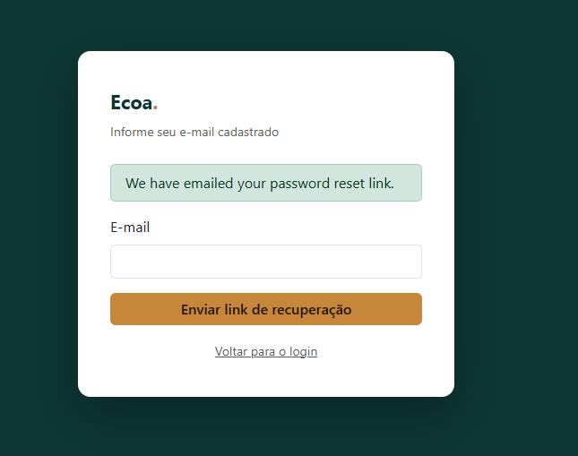
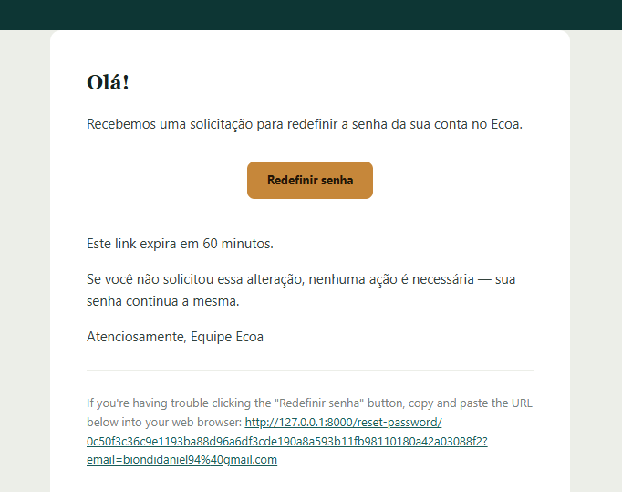
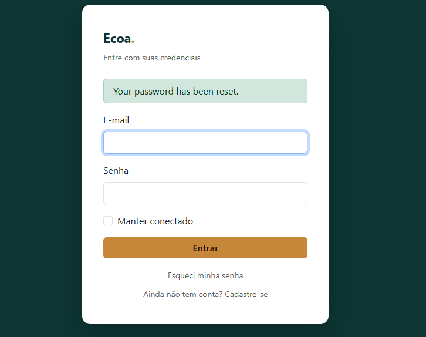
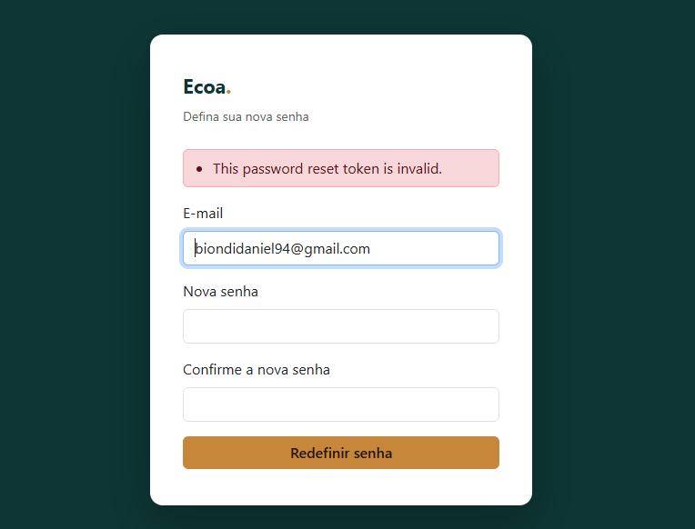
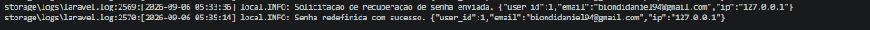

# Requisito 2 — Recuperação de Senha

Este documento apresenta a implementação do módulo de **Recuperação de Senha** do projeto **Ecoa**, desenvolvido com Laravel.

A documentação aborda os requisitos de segurança relacionados à geração do token de recuperação, seu tempo de expiração, sua invalidação após o uso, o tratamento de tokens expirados e o registro em log das solicitações e dos resultados do processo.

O objetivo desta documentação é apresentar não apenas as funcionalidades implementadas, mas também explicar as decisões técnicas utilizadas no desenvolvimento.

---

# Sumário

1. [Visão geral e tecnologias utilizadas](#1-visão-geral-e-tecnologias-utilizadas)
2. [Fluxo de recuperação de senha](#2-fluxo-de-recuperação-de-senha)
3. [Token de recuperação](#3-token-de-recuperação)
4. [Registro em log](#4-registro-em-log)
5. [Justificativas técnicas](#5-justificativas-técnicas)
6. [Evidências de funcionamento](#6-evidências-de-funcionamento)
7. [Checklist dos requisitos](#7-checklist-dos-requisitos)
8. [Considerações finais](#8-considerações-finais)

---

# 1. Visão geral e tecnologias utilizadas

O módulo de recuperação de senha do Ecoa também utiliza o **Laravel Fortify** como base, complementando o módulo de Autenticação e Gestão de Credenciais (Requisito 1).

O Fortify já fornece, de forma nativa, a geração e a validação do token de recuperação. A interface (telas de "esqueci minha senha" e "definir nova senha") foi desenvolvida separadamente, seguindo a identidade visual do Ecoa, assim como o restante do módulo de autenticação.

O registro em log das solicitações e dos resultados do processo — que não é um comportamento nativo do Fortify — foi implementado especificamente para este requisito, descrito na seção 4.

## Tecnologias utilizadas

- Laravel 12
- PHP
- Laravel Fortify
- Blade
- Bootstrap

## Principais arquivos relacionados à recuperação de senha

```text
app/Actions/Fortify/ResetUserPassword.php

→ Responsável por validar e salvar a nova senha, quando o token é válido.

app/Http/Middleware/LogPasswordResetOutcome.php

→ Registra em log o resultado (sucesso ou falha) de cada tentativa de redefinição.

app/Providers/AppServiceProvider.php

→ Registro do listener que grava em log toda solicitação de recuperação.

resources/views/auth/forgot-password.blade.php

→ Tela de solicitação do link de recuperação.

resources/views/auth/reset-password.blade.php

→ Tela de definição da nova senha.

bootstrap/app.php

→ Registro do middleware de log no grupo de rotas "web".

config/auth.php

→ Configuração do tempo de expiração e do throttle do token.
```

---

# 2. Fluxo de recuperação de senha

## 2.1 Solicitação do link de recuperação

```text
Usuário
   |
   | Acessa /forgot-password
   v
Tela de recuperação
   |
   | Informa o e-mail cadastrado
   v
Laravel Fortify
   |
   | Gera token de recuperação
   | Registra o hash do token no banco
   | Dispara o e-mail com o link
   v
Listener de log (AppServiceProvider)
   |
   | Registra a solicitação
   v
E-mail enviado ao usuário
```

Independentemente de o e-mail informado existir ou não no sistema, a tela de retorno é a mesma — isso evita que a funcionalidade seja usada para descobrir quais e-mails estão cadastrados na aplicação.

---

## 2.2 Redefinição da senha (token válido)

```text
Usuário
   |
   | Acessa o link recebido por e-mail
   v
Tela de nova senha
   |
   | Informa e-mail, nova senha e confirmação
   v
Laravel Fortify
   |
   | Localiza o token pelo hash
   | Verifica se não expirou
   v
app/Actions/Fortify/ResetUserPassword.php
   |
   | Valida a nova senha
   | Aplica o hash (Argon2id)
   | Salva no banco
   | Remove o token utilizado
   v
Middleware de log
   |
   | Registra o sucesso
   v
Redirecionamento para o login
```

---

## 2.3 Tentativa com token inválido ou expirado

```text
Usuário
   |
   | Acessa um link de recuperação
   | já utilizado, expirado ou inválido
   v
Laravel Fortify
   |
   | Verificação do token falha
   v
Tela de nova senha
   |
   | Exibe mensagem de erro
   v
Middleware de log
   |
   | Registra a falha
   v
Usuário permanece na tela, sem a senha ser alterada
```

Nesse cenário, a senha do usuário **não é alterada** — o sistema apenas informa que o token não é mais válido e mantém o formulário na tela para uma nova tentativa (por exemplo, solicitando um novo link).

---

# 3. Token de recuperação

## 3.1 Geração do token

O token de recuperação é gerado pelo próprio Laravel Fortify, utilizando uma string aleatória criptograficamente segura. No banco de dados, o sistema não armazena o token em texto puro — é armazenado apenas o **hash** do token, na tabela `password_reset_tokens`. Isso significa que, mesmo que alguém tivesse acesso de leitura ao banco de dados, não seria possível reconstruir um link de recuperação válido a partir dele.

## 3.2 Tempo de expiração

A configuração do tempo de expiração do token está em:

```text
config/auth.php
```

```php
'passwords' => [
    'users' => [
        'provider' => 'users',
        'table' => env('AUTH_PASSWORD_RESET_TOKEN_TABLE', 'password_reset_tokens'),
        'expire' => 60,
        'throttle' => 60,
    ],
],
```

| Parâmetro | Valor | Função |
|---|---:|---|
| `expire` | 60 minutos | Tempo até o token deixar de ser válido |
| `throttle` | 60 segundos | Intervalo mínimo entre duas solicitações de link para o mesmo e-mail |

O parâmetro `throttle` funciona como uma proteção complementar: evita que a funcionalidade de recuperação seja usada para gerar e-mails em excesso para uma mesma conta em um curto período.

## 3.3 Invalidação após o uso

Ao concluir a redefinição de senha com sucesso, o Laravel remove o registro do token da tabela `password_reset_tokens`. Isso garante que o mesmo link não possa ser reutilizado por engano, nem reaproveitado por alguém que tenha tido acesso a ele posteriormente (por exemplo, em uma caixa de e-mail compartilhada).

## 3.4 Falha para token expirado ou inválido

Quando o token não é encontrado, já expirou, ou não corresponde ao e-mail informado, o Fortify retorna um erro de validação, exibido na própria tela de redefinição de senha. Em nenhum desses casos a senha do usuário é alterada.

---

# 4. Registro em log

Diferente do restante do fluxo de recuperação de senha (que é todo tratado nativamente pelo Fortify), o registro em log foi implementado especificamente para este projeto, para atender aos itens 2.6 e 2.7 do checklist de segurança.

## 4.1 Log da solicitação (item 2.6)

Registrado em `app/Providers/AppServiceProvider.php`, por meio de um listener do evento de envio da notificação de recuperação de senha:

```php
Event::listen(function (\Illuminate\Notifications\Events\NotificationSending $event) {
    if ($event->notification instanceof ResetPassword) {
        Log::channel('single')->info('Solicitação de recuperação de senha enviada.', [
            'user_id' => $event->notifiable->id,
            'email' => $event->notifiable->email,
            'ip' => request()->ip(),
        ]);
    }
});
```

Esse listener é executado no momento em que o Fortify decide enviar o e-mail com o link — ou seja, toda solicitação de recuperação gera uma linha correspondente no arquivo de log.

## 4.2 Log de sucesso (item 2.7)

Também em `AppServiceProvider.php`, através do evento nativo `PasswordReset`, disparado pelo Laravel assim que uma senha é redefinida com sucesso:

```php
Event::listen(function (PasswordReset $event) {
    Log::channel('single')->info('Senha redefinida com sucesso.', [
        'user_id' => $event->user->id,
        'email' => $event->user->email,
        'ip' => request()->ip(),
    ]);
});
```

## 4.3 Log de falha (item 2.7)

Diferente do log de sucesso, a falha na redefinição não corresponde a um evento nativo do Laravel — o Fortify trata um token inválido como um erro de validação de formulário, tratado internamente antes de disparar qualquer evento customizável.

Por esse motivo, o registro da falha foi implementado por meio de um middleware próprio, que analisa o resultado da requisição:

```php
class LogPasswordResetOutcome
{
    public function handle(Request $request, Closure $next): Response
    {
        $response = $next($request);

        if ($request->routeIs('password.update') && $request->session()->has('errors')) {
            Log::channel('single')->warning('Falha na redefinição de senha.', [
                'email' => $request->input('email'),
                'ip' => $request->ip(),
            ]);
        }

        return $response;
    }
}
```

O middleware é registrado no grupo de rotas `web`, em `bootstrap/app.php`, e verifica se a requisição foi direcionada à rota `password.update` (a rota de redefinição de senha) e se a sessão recebeu erros de validação — sinal de que a tentativa falhou.

---

# 5. Justificativas técnicas

## 5.1 Por que usar o mecanismo nativo do Laravel para o token

O Laravel já implementa a geração, o armazenamento (apenas do hash) e a expiração do token de recuperação de forma consolidada e amplamente testada pela comunidade. Reimplementar essa lógica manualmente aumentaria o risco de introduzir falhas de segurança — por exemplo, gerar tokens previsíveis ou esquecer de invalidar o token após o uso.

## 5.2 Por que o token não é armazenado em texto puro

Armazenar apenas o hash do token, em vez do token em si, segue o mesmo princípio de defesa em profundidade aplicado às senhas dos usuários: mesmo que o banco de dados seja comprometido, não é possível reconstruir um link de recuperação válido a partir da informação armazenada.

## 5.3 Por que 60 minutos de expiração

Um tempo de expiração curto reduz a janela de oportunidade caso o e-mail do usuário seja comprometido ou o link seja interceptado. Sessenta minutos é o valor padrão recomendado pelo próprio framework, e representa um equilíbrio entre segurança e usabilidade — tempo suficiente para o usuário acessar o e-mail e concluir o processo, sem deixar o link válido por um período longo demais.

## 5.4 Por que registrar solicitação, sucesso e falha separadamente

Registrar os três momentos do processo (solicitação, sucesso e falha) permite reconstruir o histórico completo de uma tentativa de recuperação de senha durante uma auditoria — por exemplo, identificar se uma conta específica está recebendo tentativas repetidas de redefinição com tokens inválidos, o que pode indicar uma tentativa de ataque.

---

# 6. Evidências de funcionamento

As funcionalidades são comprovadas por meio de testes realizados através do **front-end da aplicação**, conforme solicitado na avaliação do Projeto Integrador.

As imagens estão armazenadas no diretório:

```text
docs/evidencias/
```

---

## 6.1 Solicitação de recuperação de senha



**Arquivo:**

```text
docs/evidencias/recuperacao_solicitacao.png
```

A evidência demonstra a tela `/forgot-password` preenchida com um e-mail cadastrado, e a confirmação de que o link foi enviado.

---

## 6.2 Link de recuperação gerado



**Arquivo:**

```text
docs/evidencias/recuperacao_link_gerado.png
```

A evidência demonstra o e-mail de recuperação (em ambiente de desenvolvimento, registrado no log da aplicação), contendo o link com o token gerado.

---

## 6.3 Redefinição de senha com sucesso



**Arquivo:**

```text
docs/evidencias/recuperacao_sucesso.png
```

A evidência demonstra a tela de nova senha preenchida e o redirecionamento após a redefinição concluída com sucesso.

---

## 6.4 Tentativa com token inválido



**Arquivo:**

```text
docs/evidencias/recuperacao_token_invalido.png
```

A evidência demonstra a mensagem de erro exibida ao tentar reutilizar um link de recuperação já utilizado.

---

## 6.5 Registro em log



**Arquivo:**

```text
docs/evidencias/recuperacao_logs.png
```

A evidência demonstra as três linhas correspondentes no arquivo `storage/logs/laravel.log`: solicitação, sucesso e falha de redefinição, cada uma com e-mail e endereço IP registrados.

---

# 7. Checklist dos requisitos

| Requisito | Implementação | Evidência |
|---|---|---|
| 2.1 — Funcionalidade implementada | Fluxo completo via Laravel Fortify | `recuperacao_solicitacao.png` |
| 2.2 — Token criptograficamente seguro | Token aleatório gerado pelo Fortify, hash armazenado no banco | `recuperacao_logs.png` |
| 2.3 — Token com tempo de expiração | `expire => 60` em `config/auth.php` | Este documento, seção 3.2 |
| 2.4 — Token invalidado após uso | Registro removido da tabela `password_reset_tokens` | `recuperacao_token_invalido.png` |
| 2.5 — Falha correta para token expirado | Erro de validação exibido, senha não alterada | `recuperacao_token_invalido.png` |
| 2.6 — Registro de solicitação em log | Listener em `AppServiceProvider` | `recuperacao_logs.png` |
| 2.7 — Registro de sucesso/falha do processo | Evento `PasswordReset` + middleware `LogPasswordResetOutcome` | `recuperacao_logs.png` |

---

# 8. Considerações finais

A segunda etapa do módulo de segurança do Ecoa concentra-se no processo de recuperação de senha, complementando a autenticação e a gestão de credenciais tratadas no Requisito 1.

A maior parte do fluxo é fornecida nativamente pelo Laravel Fortify, incluindo a geração segura do token, sua expiração e sua invalidação após o uso — mecanismos consolidados que reduzem o risco de falhas de segurança em comparação a uma implementação manual.

O registro em log das solicitações, dos sucessos e das falhas de redefinição foi desenvolvido especificamente para este projeto, permitindo reconstruir o histórico de tentativas de recuperação de senha durante uma eventual auditoria.

Assim como no Requisito 1, os testes realizados através da interface da aplicação foram registrados em forma de evidências e disponibilizados no diretório:

```text
docs/evidencias/
```

A documentação, o código-fonte e as evidências são mantidos junto ao projeto no GitHub, permitindo que a implementação do módulo seja analisada durante a avaliação.
