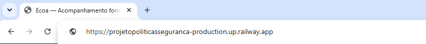
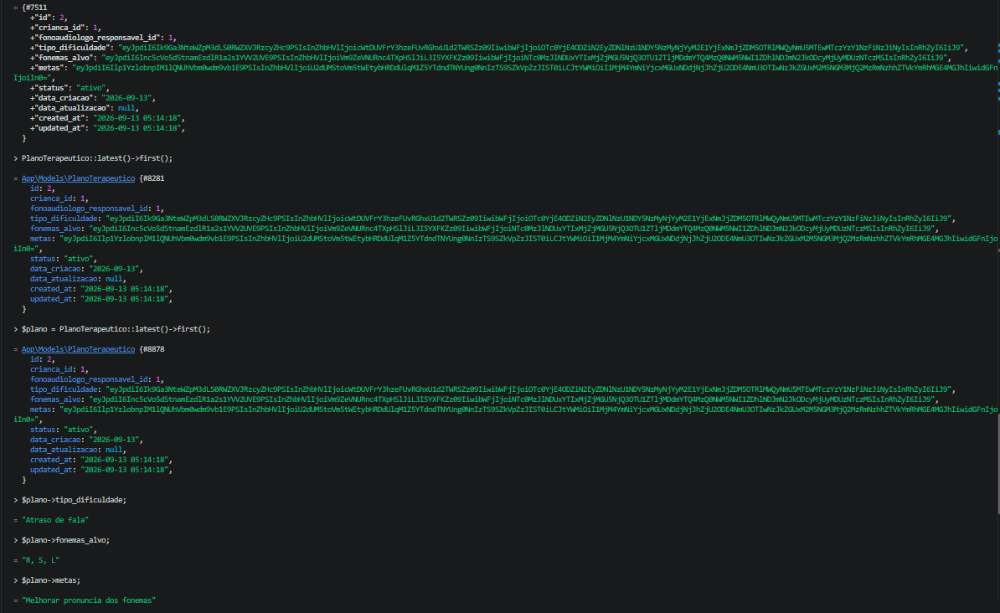

# Requisito 3 — Criptografia e Comunicação Segura

Este documento apresenta a implementação da **Criptografia e Comunicação Segura** do projeto **Ecoa**, desenvolvido com Laravel.

A documentação aborda a proteção do tráfego de rede (HTTPS), a criptografia de dados sensíveis em repouso (no banco de dados) e as decisões técnicas por trás dessas escolhas.

---

# Sumário

1. [Visão geral e tecnologias utilizadas](#1-visão-geral-e-tecnologias-utilizadas)
2. [Comunicação segura (HTTPS)](#2-comunicação-segura-https)
3. [Criptografia de dados em repouso](#3-criptografia-de-dados-em-repouso)
4. [Proteção das chaves criptográficas](#4-proteção-das-chaves-criptográficas)
5. [Justificativas técnicas](#5-justificativas-técnicas)
6. [Evidências de funcionamento](#6-evidências-de-funcionamento)
7. [Checklist dos requisitos](#7-checklist-dos-requisitos)
8. [Considerações finais](#8-considerações-finais)

---

# 1. Visão geral e tecnologias utilizadas

O Ecoa trata dados de saúde de crianças em desenvolvimento de fala — informação classificada como **dado pessoal sensível** pela LGPD (Art. 5º, II). Por esse motivo, a proteção da informação tanto em trânsito (rede) quanto em repouso (banco de dados) é tratada como requisito central do projeto, não como camada opcional.

## Tecnologias utilizadas

- Laravel 13 (criptografia nativa via `Illuminate\Encryption`)
- AES-256-CBC (algoritmo de criptografia simétrica)
- HTTPS/TLS (fornecido pela infraestrutura de hospedagem — Railway)

## Principais arquivos relacionados

```text
app/Models/PlanoTerapeutico.php
app/Models/ComentarioPlano.php
app/Models/RegistroEvolucao.php
app/Models/RegistroExercicioRealizado.php

→ Casts "encrypted" nos campos que contêm informação clínica sensível.

app/Http/Middleware/EnsureHttps.php

→ Redireciona qualquer conexão HTTP para HTTPS em produção.

app/Providers/AppServiceProvider.php

→ Força o esquema HTTPS na geração de URLs em produção.

bootstrap/app.php

→ Registro do middleware de HTTPS obrigatório no grupo de rotas "web",
   e configuração de trustProxies (necessária para o Laravel reconhecer
   corretamente conexões HTTPS atrás do proxy do Railway).
```

---

# 2. Comunicação segura (HTTPS)

## 2.1 Por que a aplicação depende do provedor de hospedagem para o TLS

O certificado TLS que viabiliza o HTTPS é emitido e gerenciado pela própria plataforma de hospedagem (Railway), não pela aplicação Laravel em si — esse é o modelo padrão de qualquer aplicação web moderna hospedada em PaaS (Platform as a Service). A responsabilidade da aplicação é **garantir que nenhuma comunicação ocorra fora desse canal seguro**, o que é tratado nos itens a seguir.

## 2.2 Bloqueio de conexões inseguras

Foi implementado um middleware próprio (`EnsureHttps`) que verifica, em cada requisição, se a conexão está sendo feita via HTTPS. Caso contrário, o usuário é **redirecionado automaticamente** para a versão segura da mesma URL:

```php
class EnsureHttps
{
    public function handle(Request $request, Closure $next): Response
    {
        if (app()->environment('production') && ! $request->secure()) {
            return redirect()->secure($request->getRequestUri());
        }

        return $next($request);
    }
}
```

O middleware é aplicado apenas em ambiente de `production`, permitindo que o ambiente de desenvolvimento local continue funcionando normalmente via HTTP (`localhost` não possui certificado TLS).

## 2.3 Reconhecimento correto do protocolo atrás do proxy

Plataformas como o Railway posicionam a aplicação atrás de um proxy reverso. Sem uma configuração explícita, o Laravel pode não reconhecer corretamente que a conexão original do usuário foi feita via HTTPS, o que compromete tanto a geração de URLs quanto a segurança de cookies de sessão. Isso foi corrigido com:

```php
$middleware->trustProxies(at: '*');
```

registrado em `bootstrap/app.php`, e complementado pela variável de ambiente `SESSION_SECURE_COOKIE=true`, que garante que o cookie de sessão só trafegue por conexões HTTPS.

---

# 3. Criptografia de dados em repouso

## 3.1 Campos criptografados

Os campos que armazenam informação clínica/terapêutica sensível são automaticamente criptografados antes de serem salvos no banco de dados, por meio do recurso de *cast* `encrypted` do Eloquent (ORM do Laravel):

| Model | Campos criptografados |
|---|---|
| `PlanoTerapeutico` | `tipo_dificuldade`, `fonemas_alvo`, `metas` |
| `ComentarioPlano` | `comentario` |
| `RegistroEvolucao` | `observacoes` |
| `RegistroExercicioRealizado` | `observacao` |

Exemplo de implementação (`app/Models/PlanoTerapeutico.php`):

```php
protected $casts = [
    'tipo_dificuldade' => 'encrypted',
    'fonemas_alvo' => 'encrypted',
    'metas' => 'encrypted',
];
```

## 3.2 Como funciona, na prática

Ao salvar um registro, o Laravel criptografa o valor automaticamente antes de gravar no banco. Ao ler o registro **através do Model** (Eloquent), o valor é decriptado automaticamente e apresentado normalmente na aplicação — a criptografia é transparente para o restante do código.

Se o mesmo dado for consultado **diretamente no banco**, sem passar pelo Model (por exemplo, via `DB::table(...)`, ou por qualquer pessoa com acesso direto ao banco de dados), o valor aparece como uma string cifrada, ilegível sem a chave de aplicação.

## 3.3 Dados que permanecem sem criptografia

Dados cadastrais não sensíveis (nome da criança, data de nascimento, nome de usuários, e-mails) não são criptografados em repouso — apenas o conteúdo clínico/terapêutico (indicações de dificuldade, metas terapêuticas, comentários e observações de evolução) recebe essa proteção adicional. Essa escolha segue o princípio de minimização: aplicar criptografia adicional apenas onde o dado é de fato sensível, evitando complexidade desnecessária em campos que já são protegidos pelos demais controles de acesso do sistema (autenticação, 2FA e permissão por perfil).

---

# 4. Proteção das chaves criptográficas

A chave utilizada pela criptografia do Laravel (`APP_KEY`) nunca é incluída no código-fonte nem no repositório Git:

- Em ambiente local, fica apenas no arquivo `.env`, listado no `.gitignore`;
- Em produção (Railway), é armazenada exclusivamente como variável de ambiente do serviço, configurada fora do código-fonte.

Isso significa que, mesmo que o repositório do projeto seja inteiramente público (como é o caso), a chave necessária para decriptar os dados sensíveis nunca fica exposta.

---

# 5. Justificativas técnicas

## 5.1 Por que utilizar o mecanismo nativo do Laravel em vez de uma biblioteca externa

O Laravel implementa criptografia simétrica utilizando **AES-256-CBC** com autenticação de mensagem (HMAC), de forma já auditada e amplamente utilizada pela comunidade. Reimplementar criptografia manualmente é desaconselhado pela própria literatura de segurança — pequenos erros de implementação (como reutilização de vetor de inicialização, ou ausência de autenticação da mensagem) podem comprometer inteiramente a proteção, mesmo utilizando um algoritmo correto.

## 5.2 Por que AES-256-CBC é considerado adequado

O AES (Advanced Encryption Standard) é o padrão de criptografia simétrica adotado por governos e pela indústria, incluindo aplicações que lidam com dados de saúde. A variante de 256 bits utilizada pelo Laravel está entre as configurações mais robustas atualmente recomendadas, e cada valor criptografado inclui um vetor de inicialização (IV) único, o que impede que o mesmo dado em texto plano gere sempre o mesmo texto cifrado.

## 5.3 Por que forçar HTTPS em toda a aplicação, e não apenas nas telas de login

Restringir o HTTPS apenas a telas específicas (como login) deixaria desprotegido o tráfego de dados sensíveis nas demais páginas do sistema — por exemplo, ao visualizar um plano terapêutico ou um registro de evolução. Como o Ecoa trata dado de saúde infantil em praticamente todas as suas telas autenticadas, a decisão foi aplicar HTTPS obrigatório de forma global.

## 5.4 Por que a chave de criptografia fica apenas em variável de ambiente

Esse é um princípio básico de segurança conhecido como separação entre código e configuração sensível. Um repositório de código — especialmente um repositório público, como é o caso deste projeto acadêmico — não deve nunca conter segredos. Caso a chave estivesse no código, qualquer pessoa com acesso ao repositório teria acesso completo aos dados sensíveis armazenados, tornando toda a criptografia inútil.

---

# 6. Evidências de funcionamento

As funcionalidades são comprovadas por meio de testes realizados através do **front-end da aplicação** e do console Tinker, conforme solicitado na avaliação do Projeto Integrador.

As imagens estão armazenadas no diretório:

```text
docs/evidencias/
```

---

## 6.1 Conexão HTTPS ativa


**Arquivo:**
```text
docs/evidencias/criptografia_https_cadeado.png
```

A evidência demonstra o ícone de cadeado na barra de endereço do navegador, confirmando a conexão segura com a aplicação em produção.

---

## 6.2 Redirecionamento de HTTP para HTTPS



**Arquivo:**
```text
docs/evidencias/criptografia_bloqueio_http.png
```

A evidência demonstra o redirecionamento automático ao tentar acessar a aplicação via `http://`, confirmando que conexões não seguras não são permitidas.

---

## 6.3 Dado criptografado em repouso



**Arquivo:**
```text
docs/evidencias/criptografia_dado_cifrado.png
```

A evidência demonstra, via Laravel Tinker, o mesmo registro de Plano Terapêutico: primeiro consultado diretamente no banco de dados (`DB::table(...)`), exibindo os campos `tipo_dificuldade`, `fonemas_alvo` e `metas` como texto cifrado, e em seguida acessado por meio do Model (`PlanoTerapeutico`), exibindo os mesmos campos já decriptados.

---

# 7. Checklist dos requisitos

| Requisito | Implementação | Evidência |
|---|---|---|
| 3.1 — Comunicação protegida por TLS/HTTPS | Certificado gerenciado pelo Railway + `trustProxies` | `criptografia_https_cadeado.png` |
| 3.2 — Bloqueio de conexões não seguras | Middleware `EnsureHttps` | `criptografia_bloqueio_http.png` |
| 3.3 — Evidência de tráfego cifrado | Cadeado HTTPS ativo na aplicação em produção | `criptografia_https_cadeado.png` |
| 3.4 — Dados sensíveis criptografados em repouso | Cast `encrypted` do Eloquent em campos clínicos | `criptografia_dado_cifrado.png` |
| 3.5 — Uso de algoritmo criptográfico adequado (AES) | AES-256-CBC, nativo do Laravel | Este documento, seção 5.2 |
| 3.6 — Chaves criptográficas protegidas | `APP_KEY` apenas em variável de ambiente, fora do repositório | Este documento, seção 4 |
| 3.7 — Estratégia de criptografia documentada | Este documento | — |
| 3.8 — Justificativa técnica das escolhas | Este documento, seção 5 | — |

---

# 8. Considerações finais

A terceira etapa do módulo de segurança do Ecoa trata da proteção do dado em dois momentos distintos: em trânsito, por meio de HTTPS obrigatório em toda a aplicação, e em repouso, por meio de criptografia AES-256 aplicada especificamente aos campos que carregam informação clínica sensível.

A escolha por utilizar mecanismos nativos do Laravel — tanto para a criptografia quanto para o reconhecimento de conexões seguras atrás de proxy — segue o mesmo princípio adotado nos Requisitos 1 e 2: preferir soluções consolidadas e amplamente testadas pela comunidade a implementações manuais, reduzindo a superfície de risco de falhas de segurança introduzidas pelo próprio desenvolvimento.

A documentação, o código-fonte e as evidências são mantidos junto ao projeto no GitHub, permitindo que a implementação do módulo seja analisada durante a avaliação.
